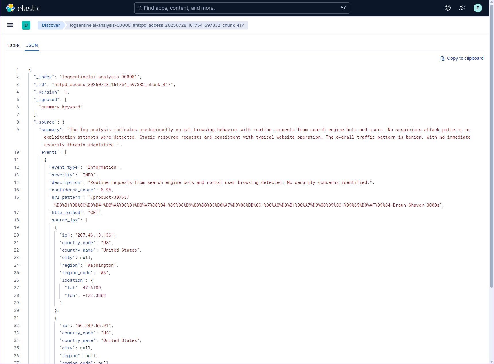

# LogSentinelAI - AI-Powered Log Security Analysis

LogSentinelAI is a system that leverages LLM (Large Language Model) to analyze various log files and detect security events. It automatically analyzes Apache HTTP logs, Linux system logs, and other log types to identify security threats and stores them as structured data in Elasticsearch for visualization and analysis.

## 🌟 Key Features

- **Multi-format Log Support**: HTTP Access Log, Apache Error Log, Linux System Log, Network Packet Analysis
- **AI-based Security Analysis**: Intelligent security event detection through LLM
- **Structured Generation**: Uses [Outlines](https://github.com/dottxt-ai/outlines) for reliable JSON output from LLM
- **Network Packet Analysis**: tcpdump packet inspection and security analysis
- **Structured Data Output**: JSON schema validation using Pydantic models
- **Elasticsearch Integration**: Real-time log analysis result storage and search
- **Kibana Dashboard**: Visualized security analysis result monitoring
- **LOGID Tracking**: Complete traceability between original logs and analysis results
- **LLM Provider Support**: Compatible with OpenAI, vLLM, and Ollama

## 📊 Dashboard Example


## 📋 JSON Output Example



## 🏗️ System Architecture

```
┌─────────────────┐    ┌─────────────────┐    ┌─────────────────┐
│   Log Files     │───>│ LogSentinelAI   │───>│ Elasticsearch   │
│                 │    │   Analysis      │    │                 │
│ • HTTP Access   │    │                 │    │ • Security      │
│ • Apache Error  │    │ • LLM Analysis  │    │   Events        │
│ • System Logs   │    │ • Outlines      │    │ • Raw Logs      │
│ • Network Pcap  │    │ • Pydantic      │    │ • Metadata      │
│                 │    │   Validation    │    │                 │
└─────────────────┘    └─────────────────┘    └─────────────────┘
                                                        │
                                                        ▼
                                              ┌─────────────────┐
                                              │     Kibana      │
                                              │   Dashboard     │
                                              │                 │
                                              │ • Visualization │
                                              │ • Alerts        │
                                              │ • Analytics     │
                                              └─────────────────┘
```

## 🚀 QuickStart: OpenAI API Installation & Setup

### 1. Prerequisites

- **Operating Systems**: Linux, Windows, Mac all supported
- **Python**: 3.11 or higher
- **Elasticsearch/Kibana**: 9.0.3 or higher (Docker-based installation recommended)

### 2. Project Installation

```bash
# 1. Clone repository and navigate to directory
git clone https://github.com/call518/LogSentinelAI.git
cd LogSentinelAI

# 2. Create and activate Python virtual environment
python -m venv .venv
source .venv/bin/activate  # Linux/Mac
# .venv\Scripts\activate   # Windows

# 3. Install packages
pip install -r requirements.txt

# 4. Setup configuration file
cp config.template config
# Edit config file and set OPENAI_API_KEY value (obtained from OpenAI account)

# 5. LLM Configuration (set in config file)
# For OpenAI API usage, configure in config file as follows:
#   LLM_PROVIDER=openai  (default)
#   LLM_MODEL_OPENAI=gpt-4o-mini  (default)
```

### 3. Elasticsearch & Kibana Installation (Docker)

```bash
# 1. Clone ELK stack repository and navigate to directory
git clone https://github.com/call518/Docker-ELK.git
cd Docker-ELK

# 2. Initialize and run ELK stack
# One-time initialization
docker compose up setup
# Generate Kibana encryption keys (recommended)
docker compose up kibana-genkeys
# Copy generated keys to kibana/config/kibana.yml
# Start ELK stack
docker compose up -d

# 3. Access Kibana: http://localhost:5601
# Default credentials: elastic / changeme
```

### 4. Elasticsearch Index/Policy/Template Setup

```bash
# 1. Create ILM policy (7-day retention, 10GB/1-day rollover)
curl -X PUT "localhost:9200/_ilm/policy/logsentinelai-analysis-policy" \
-H "Content-Type: application/json" \
-u elastic:changeme \
-d '{
  "policy": {
    "phases": {
      "hot": {
        "actions": {
          "rollover": {
            "max_size": "10gb",
            "max_age": "1d"
          }
        }
      },
      "delete": {
        "min_age": "7d",
        "actions": {
          "delete": {}
        }
      }
    }
  }
}'

# 2. Create index template
curl -X PUT "localhost:9200/_index_template/logsentinelai-analysis-template" \
-H "Content-Type: application/json" \
-u elastic:changeme \
-d '{
  "index_patterns": ["logsentinelai-analysis-*"],
  "template": {
    "settings": {
      "number_of_shards": 1,
      "number_of_replicas": 1,
      "index.lifecycle.name": "logsentinelai-analysis-policy",
      "index.lifecycle.rollover_alias": "logsentinelai-analysis"
    },
    "mappings": {
      "properties": {
        "@log_raw_data": {
          "type": "object",
          "dynamic": false
        }
      }
    }
  }
}'

# 3. Create initial index and write alias
curl -X PUT "localhost:9200/logsentinelai-analysis-000001" \
-H "Content-Type: application/json" \
-u elastic:changeme \
-d '{
  "aliases": {
    "logsentinelai-analysis": {
      "is_write_index": true
    }
  }
}'
```

### 5. Run Log Analysis (OpenAI API based)

```bash
# HTTP access log analysis
python analysis-httpd-access-log.py

# Apache error log analysis
python analysis-httpd-apache-log.py

# Linux system log analysis
python analysis-linux-system-log.py

# Network packet analysis (tcpdump)
python analysis-tcpdump-packet.py
```

### 6. Import Kibana Dashboard/Settings

```bash
# 1. Access Kibana: http://localhost:5601
# 2. Login: elastic / changeme
# 3. Stack Management > Saved Objects > Import
#    - Kibana-9.0.3-Advanced-Settings.ndjson (first)
#    - Kibana-9.0.3-Dashboard-LogSentinelAI.ndjson (second)
# 4. Check results at Analytics > Dashboard > LogSentinelAI Dashboard
```

---

## 🔄 Change LLM Provider/Advanced Options (Optional)

To change from OpenAI API to Ollama (local), vLLM (local/GPU), etc., please refer to the guide below.

### LLM Provider & Model Configuration (`config` file modification)

LogSentinelAI centrally manages LLM Provider and model in the `config` file.

#### OpenAI API Configuration (Default)
```bash
# Configure in config file
LLM_PROVIDER=openai
LLM_MODEL_OPENAI=gpt-4o-mini

# API key configuration required
OPENAI_API_KEY=your_openai_api_key_here
```

#### Ollama (Local LLM) Configuration
```bash
# 1. Install Ollama and download model
ollama pull qwen2.5-coder:3b
ollama serve
```

```bash
# Change configuration in config file
LLM_PROVIDER=ollama
LLM_MODEL_OLLAMA=qwen2.5-coder:3b
```

#### vLLM (Local GPU) Configuration
```bash
# Option A: Clone and use vLLM-Tutorial (recommended)
git clone https://github.com/call518/vLLM-Tutorial.git
cd vLLM-Tutorial

# Install Hugging Face CLI for model download
pip install huggingface_hub

# Download model
huggingface-cli download lmstudio-community/Qwen2.5-3B-Instruct-GGUF Qwen2.5-3B-Instruct-Q4_K_M.gguf --local-dir ./models/Qwen2.5-3B-Instruct/
huggingface-cli download Qwen/Qwen2.5-3B-Instruct generation_config.json --local-dir ./config/Qwen2.5-3B-Instruct

# Download model (Optional)
huggingface-cli download lmstudio-community/Qwen2.5-1.5B-Instruct-GGUF Qwen2.5-1.5B-Instruct-Q4_K_M.gguf --local-dir ./models/Qwen2.5-1.5B-Instruct/
huggingface-cli download Qwen/Qwen2.5-1.5B-Instruct generation_config.json --local-dir ./config/Qwen2.5-1.5B-Instruct

# Change value of temperature : 0.7 --> 0.0
cat config/Qwen2.5-3B-Instruct/generation_config.json
{
  "bos_token_id": 151643,
  "pad_token_id": 151643,
  "do_sample": true,
  "eos_token_id": [
    151645,
    151643
  ],
  "repetition_penalty": 1.05,
  "temperature": 0.0,
  "top_p": 0.8,
  "top_k": 20,
  "transformers_version": "4.37.0"
}

# Run vLLM with Docker
./run-docker-vllm---Qwen2.5-3B-Instruct.sh

# Verify API is working
curl -s -X GET http://localhost:5000/v1/models | jq

# Option B: Simple vLLM setup (without Docker)
pip install vllm
python -m vllm.entrypoints.openai.api_server --model qwen2.5-coder:3b
```

```bash
# Change configuration in config file
LLM_PROVIDER=vllm
LLM_MODEL_VLLM=Qwen/Qwen2.5-1.5B-Instruct
```

### Additional Configuration Options (`config` file)

#### Response Language Configuration
```bash
# Configure analysis result language
RESPONSE_LANGUAGE=korean    # Korean (default)
# RESPONSE_LANGUAGE=english # English
```

#### Log File Path and Chunk Size Configuration
```bash
# Configure log file paths
LOG_PATH_HTTPD_ACCESS=sample-logs/access-10k.log      # 10k entries (default)
LOG_PATH_HTTPD_APACHE_ERROR=sample-logs/apache-10k.log
LOG_PATH_LINUX_SYSTEM=sample-logs/linux-2k.log
LOG_PATH_TCPDUMP_PACKET=sample-logs/tcpdump-packet-2k.log

# Configure chunk sizes (number of log entries to process at once)
CHUNK_SIZE_HTTPD_ACCESS=10        # HTTP access logs
CHUNK_SIZE_HTTPD_APACHE_ERROR=10  # Apache error logs
CHUNK_SIZE_LINUX_SYSTEM=10       # Linux system logs
CHUNK_SIZE_TCPDUMP_PACKET=5       # Network packets (smaller chunks recommended)
```

### Verify Configuration Changes
```bash
# Run analysis after configuration changes to verify operation
python analysis-httpd-access-log.py
```

---
## 📁 Project Structure

```
LogSentinelAI/
├── analysis-httpd-access-log.py    # HTTP access log analyzer
├── analysis-httpd-apache-log.py    # Apache error log analyzer
├── analysis-linux-system-log.py    # Linux system log analyzer
├── analysis-tcpdump-packet.py      # Network packet analyzer (tcpdump)
├── commons.py                      # Common functions and utilities
├── prompts.py                      # LLM prompt templates
├── requirements.txt                # Python dependencies
├── config                         # Configuration file (created from template)
├── config.template                # Configuration template
├── .env                           # Environment variables (deprecated - use config instead)
├── .env.template                  # Environment variables template (deprecated)
├── .gitignore                     # Git ignore file
├── LICENSE                        # MIT License
├── README.md                      # This file
├── sample-logs/                   # Sample log files
│   ├── access-100.log             # 100 HTTP access log entries
│   ├── access-10k.log             # 10,000 HTTP access log entries
│   ├── apache-100.log             # 100 Apache error log entries
│   ├── apache-10k.log             # 10,000 Apache error log entries
│   ├── linux-100.log              # 100 Linux system log entries
│   ├── linux-2k.log               # 2,000 Linux system log entries
│   ├── tcpdump-packet-39.log      # Sample tcpdump packet capture (39 packets)
│   └── tcpdump-packet-2k.log      # Sample tcpdump packet capture (2,000 packets)
├── img/                           # Documentation images
│   ├── ex-dashboard.png           # Kibana dashboard example
│   └── ex-json.png                # JSON output example
├── Kibana-9.0.3-Advanced-Settings.ndjson    # Kibana advanced settings (index patterns, etc.)
└── Kibana-9.0.3-Dashboard-LogSentinelAI.ndjson # Kibana dashboard configuration
```

## 🔧 Configuration Options

### Change LLM Provider

You can change the LLM provider in each analysis script:

```python
# In each analysis script (analysis-httpd-access-log.py, etc.)
llm_provider = "vllm"  # Choose from "ollama", "vllm", "openai"
model = initialize_llm_model(llm_provider)
```

Available providers:
- **Ollama**: Local model execution with models like `qwen2.5-coder:3b`
- **vLLM**: GPU-accelerated local inference with OpenAI-compatible API
- **OpenAI**: Cloud-based API using models like `gpt-4o-mini`

### Adjust Chunk Size

You can adjust chunk size for log processing performance:

```python
# In each analysis script
chunk_size = 5  # Default value, adjust as needed (typically 5-10)
```

### Sample Log Files

The project includes different sized sample files for testing:

```python
# Choose log file size in each script
# log_path = "sample-logs/access-10.log"     # 10 entries
# log_path = "sample-logs/access-100.log"    # 100 entries  
log_path = "sample-logs/access-10k.log"     # 10,000 entries (default)
```

## 📊 Output Data Schema

### Security Event Structure

```json
{
  "event_type": "SQL_INJECTION",
  "severity": "HIGH",
  "description": "SQL injection attack attempt detected",
  "confidence_score": 0.85,
  "url_pattern": "/api/users",
  "http_method": "POST",
  "source_ips": ["192.168.1.100"],
  "response_codes": ["403"],
  "attack_patterns": ["SQL_INJECTION"],
  "recommended_actions": ["Block IP", "Add WAF rule"],
  "requires_human_review": true,
  "related_log_ids": ["LOGID-7DD17B008706AC22C60AD6DF9AC5E2E9", "LOGID-F3B6E3F03EC9E5BC1F65624EB65C6C51"]
}
```

### Elasticsearch Document Structure

```json
{
  "chunk_analysis_start_utc": "2025-07-18T10:00:00Z",
  "chunk_analysis_end_utc": "2025-07-18T10:00:05Z", 
  "@processing_result": "success",
  "@timestamp": "2025-07-18T10:00:05.123Z",
  "@log_type": "httpd_access",
  "@document_id": "httpd_access_20250718_100005_123456_chunk_1",
  "@log_raw_data": {
    "LOGID-7DD17B008706AC22C60AD6DF9AC5E2E9": "192.168.1.100 - - [18/Jul/2025:10:00:01] GET /api/users",
    "LOGID-F3B6E3F03EC9E5BC1F65624EB65C6C51": "192.168.1.100 - - [18/Jul/2025:10:00:02] POST /api/login"
  },
  "summary": "Analysis summary in English",
  "events": [
    {
      "event_type": "SQL_INJECTION",
      "severity": "HIGH", 
      "description": "SQL injection attack attempt detected",
      "confidence_score": 0.85,
      "related_log_ids": ["LOGID-7DD17B008706AC22C60AD6DF9AC5E2E9"],
      ...
    }
  ],
  "statistics": {...},
  "highest_severity": "HIGH",
  "requires_immediate_attention": true
}
```

## 🎯 Advanced Features

### 1. Structured Generation with Outlines
- **Reliable JSON Output**: Uses [Outlines](https://github.com/dottxt-ai/outlines) library for guaranteed structured generation
- **Schema-Guided Generation**: Pydantic models ensure LLM outputs follow exact JSON schemas
- **Enhanced Parsing Reliability**: Eliminates JSON parsing errors through guided generation
- **Multi-Provider Support**: Works consistently across OpenAI, vLLM, and Ollama providers
- **Performance Optimization**: Faster and more reliable than post-processing approaches

### 2. Intelligent Security Detection
- **Various Attack Pattern Recognition**: SQL Injection, XSS, Brute Force, Command Injection, etc.
- **Context-based Analysis**: Analysis considering log patterns and correlations
- **Confidence Score**: Confidence level for each detection result
- **Mandatory Event Generation**: Every log chunk generates at least one security event
- **Balanced Severity Assessment**: Enhanced sensitivity for security pattern detection

### 3. Complete Traceability  
- **LOGID System**: Unique MD5-based identifier for each log line (e.g., `LOGID-7DD17B008706AC22C60AD6DF9AC5E2E9`)
- **Original Data Preservation**: Raw log data stored with `@log_raw_data` field in Elasticsearch
- **Related Log Mapping**: LLM specifies which LOGIDs are related to each security event
- **Full Audit Trail**: Complete traceability from original logs to analysis results

### 4. Scalable Architecture
- **Modular Design**: Independent analyzer for each log type
- **Shared Commons Library**: Centralized functions in `commons.py` for code reusability
- **Chunk-based Processing**: Memory-efficient processing of large log files
- **Error Handling**: Robust error handling with failure tracking in Elasticsearch

## 📈 Performance Optimization

### Structured Generation
- **Outlines Library**: Eliminates JSON parsing errors through guided generation
- **Schema Validation**: Pydantic models ensure consistent output structure
- **Faster Processing**: Avoids retry loops from malformed JSON responses
- **Memory Efficiency**: Direct structured output without post-processing overhead

### Chunk-based Processing
- Process large log files by dividing into small chunks (default: 5 entries per chunk)
- Memory efficiency and error isolation
- Independent processing of each chunk with failure tracking

### Token Optimization
- Prompt optimization to minimize LLM input tokens
- Structured output using Pydantic models for parsing efficiency
- Simplified JSON schemas to reduce redundancy

### Error Resilience
- Comprehensive error handling with JSON parsing fallbacks
- Failed chunk analysis recorded in Elasticsearch for debugging
- Continued processing even when individual chunks fail

## 🔍 Monitoring & Alerting

### Kibana Dashboard
- Real-time security event monitoring
- Attack trend and pattern analysis
- Geographic location-based attack visualization

### Alert Configuration
- Automatic alerts for high-risk security events
- Threshold-based alert rules
- Email/Slack integration support

## 🤝 Contributing

1. Fork the repository
2. Create a feature branch (`git checkout -b feature/amazing-feature`)
3. Commit your changes (`git commit -m 'Add some amazing feature'`)
4. Push to the branch (`git push origin feature/amazing-feature`)
5. Open a Pull Request

## 📝 License

This project is distributed under the MIT License. See [LICENSE](LICENSE) file for more details.

## 🆘 Support & Contact

- **Issues**: [GitHub Issues](https://github.com/call518/LogSentinelAI/issues)
- **Documentation**: [GitHub Wiki](https://github.com/call518/LogSentinelAI/wiki)
- **Repository**: [GitHub Repository](https://github.com/call518/LogSentinelAI)
- **Email**: support@logsentinelai.dev

## 🏷️ Version Information

- **Python**: 3.11+
- **Elasticsearch**: 9.0.3+
- **Kibana**: 9.0.3+
- **Key Dependencies**: 
  - `outlines` for structured LLM output generation
  - `pydantic` for data validation and schema enforcement
  - `elasticsearch` for data storage and search capabilities
  - `ollama`, `openai` for LLM provider integrations

### 🔗 Important Links
- **Outlines Library**: [https://github.com/dottxt-ai/outlines](https://github.com/dottxt-ai/outlines)
- **Outlines Documentation**: [https://dottxt-ai.github.io/outlines/](https://dottxt-ai.github.io/outlines/)
- **Pydantic**: [https://docs.pydantic.dev/](https://docs.pydantic.dev/)
- **Elasticsearch**: [https://www.elastic.co/elasticsearch/](https://www.elastic.co/elasticsearch/)

## 📋 ToDo & Roadmap

### 🎯 Upcoming Features

#### Real-time Log Analysis
- **Real-time Log File Monitoring**: Implement file watcher to detect new log entries
- **Sampling vs. Full Processing**: Add configurable sampling strategies for high-volume logs
- **Stream Processing**: Support for continuous log stream analysis
- **Performance Modes**: 
  - Full processing mode for comprehensive analysis
  - Sampling mode for high-throughput scenarios

#### Performance Enhancements
- **LLM Processing Optimization**: Improve throughput (logs per second)
- **Batch Processing**: Process multiple log chunks in parallel
- **Model Caching**: Cache LLM responses for similar log patterns
- **Async Processing**: Implement asynchronous log analysis pipeline

### 🚀 Future Enhancements
- **Machine Learning Integration**: Anomaly detection using ML models
- **Custom Rule Engine**: User-defined security rules and patterns
- **Multi-tenant Support**: Support for multiple organizations/tenants
- **Advanced Visualization**: Enhanced Kibana dashboards with geo-mapping
- **API Integration**: RESTful API for external system integration

## 🔧 Technical Implementation

### Outlines Integration
LogSentinelAI leverages the [Outlines](https://github.com/dottxt-ai/outlines) library for structured generation, ensuring reliable JSON output from Language Models:

```python
# Example of structured generation with Outlines
from outlines import models, generate
from pydantic import BaseModel

class SecurityEvent(BaseModel):
    event_type: str
    severity: str
    description: str
    confidence_score: float

# Initialize model with Outlines
model = models.transformers("microsoft/DialoGPT-medium")
generator = generate.json(model, SecurityEvent)

# Generate structured output
result = generator(prompt)  # Always returns valid SecurityEvent JSON
```

### Why Outlines?
- **Guaranteed Structure**: Unlike traditional LLM outputs, Outlines ensures the response always follows the specified schema
- **No Parsing Errors**: Eliminates JSON parsing failures and retry logic
- **Better Performance**: Faster processing through guided generation
- **Multi-Provider Support**: Works with various LLM backends (OpenAI, vLLM, Ollama)
- **Type Safety**: Perfect integration with Pydantic models for type-safe data handling

---

**LogSentinelAI** - Intelligent Log Security Analysis with AI 🔍🛡️