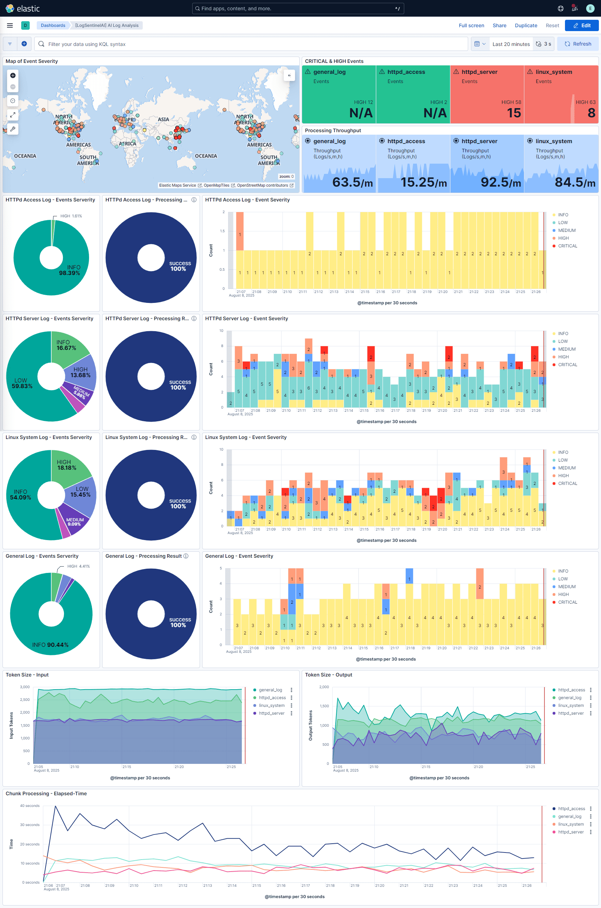

# SonarLog - AI-Powered Log Security Analysis

SonarLog is a system that leverages LLM (Large Language Model) to analyze various log files and detect security events. It automatically analyzes Apache HTTP logs, Linux system logs, and other log types to identify security threats and stores them as structured data in Elasticsearch.

## 🌟 Key Features

- **Multi-format Log Support**: HTTP Access Log, Apache Error Log, Linux System Log
- **AI-based Security Analysis**: Intelligent security event detection through LLM
- **Structured Data Output**: JSON schema validation using Pydantic models
- **Elasticsearch Integration**: Real-time log analysis result storage and search
- **Kibana Dashboard**: Visualized security analysis result monitoring
- **LOGID Tracking**: Complete traceability between original logs and analysis results

## 📊 Dashboard Example



## 📋 JSON Output Example


## 🏗️ System Architecture

```
┌─────────────────┐    ┌─────────────────┐    ┌─────────────────┐
│   Log Files     │───▶│   SonarLog      │───▶│ Elasticsearch   │
│                 │    │   Analysis      │    │                 │
│ • HTTP Access   │    │                 │    │ • Security      │
│ • Apache Error  │    │ • LLM Analysis  │    │   Events        │
│ • System Logs   │    │ • Pydantic      │    │ • Raw Logs      │
│                 │    │   Validation    │    │ • Metadata      │
└─────────────────┘    └─────────────────┘    └─────────────────┘
                                                        │
                                                        ▼
                                               ┌─────────────────┐
                                               │     Kibana      │
                                               │   Dashboard     │
                                               │                 │
                                               │ • Visualization │
                                               │ • Alerts        │
                                               │ • Analytics     │
                                               └─────────────────┘
```

## 🚀 Installation & Setup

### 1. Install Dependencies

```bash
# Create Python virtual environment (optional)
python -m venv .venv
source .venv/bin/activate  # Linux/Mac
# .venv\Scripts\activate   # Windows

# Install packages
pip install -r requirements.txt
```

### 2. Environment Variable Setup

```bash
# Create .env file
cp .env.template .env

# Set OpenAI API key (when using OpenAI)
echo "OPENAI_API_KEY=your_api_key_here" >> .env
```

### 3. LLM Model Setup

#### Option 1: Ollama (Local Execution)
```bash
# Install Ollama and download model
ollama pull qwen2.5-coder:3b
ollama serve
```

#### Option 2: vLLM (GPU Acceleration)
```bash
# Install vLLM and run server
pip install vllm
python -m vllm.entrypoints.openai.api_server --model qwen2.5-coder:3b
```

#### Option 3: OpenAI API
- Set `OPENAI_API_KEY` in `.env` file

### 4. Elasticsearch Setup

- Github: https://github.com/call518/Docker-ELK

```bash
# Run Elasticsearch + Kibana with Docker Compose
docker-compose up -d

# Or install local Elasticsearch
# Check Elasticsearch port 9200, Kibana port 5601
```

## 💻 Usage

### HTTP Access Log Analysis

```bash
python analysis-httpd-access-log.py
```

### Apache Error Log Analysis

```bash
python analysis-httpd-apache-log.py
```

### Linux System Log Analysis

```bash
python analysis-linux-system-log.py
```

## 📁 Project Structure

```
SonarLog/
├── analysis-httpd-access-log.py    # HTTP access log analyzer
├── analysis-httpd-apache-log.py    # Apache error log analyzer
├── analysis-linux-system-log.py    # Linux system log analyzer
├── commons.py                      # Common functions and utilities
├── requirements.txt                # Python dependencies
├── .env.template                   # Environment variables template
├── .gitignore                      # Git ignore file
├── LICENSE                         # MIT License
├── ex-01.ipynb                     # Jupyter notebook examples
├── ex-02-ollama.ipynb              # Ollama-specific examples
├── sample-logs/                    # Sample log files
│   ├── access-10.log              # 10 HTTP access log entries
│   ├── access-100.log             # 100 HTTP access log entries  
│   ├── access-10k.log             # 10,000 HTTP access log entries
│   ├── apache-10.log              # 10 Apache error log entries
│   ├── apache-100.log             # 100 Apache error log entries
│   ├── apache-10k.log             # 10,000 Apache error log entries
│   ├── linux-10.log               # 10 Linux system log entries
│   ├── linux-100.log              # 100 Linux system log entries
│   └── linux-2k.log               # 2,000 Linux system log entries
├── img/                           # Documentation images
│   ├── ex-dashboard.png
│   └── ex-json.png
└── Kibana-Dashboard-SonarLog.ndjson # Kibana dashboard configuration
```

## 🔧 Configuration Options

### Change LLM Provider

You can change the LLM provider in each analysis script:

```python
# In each analysis script (analysis-httpd-access-log.py, etc.)
llm_provider = "vllm"  # Choose from "ollama", "vllm", "openai"
model = initialize_llm_model(llm_provider)
```

Available providers:
- **Ollama**: Local model execution with models like `qwen2.5-coder:3b`
- **vLLM**: GPU-accelerated local inference with OpenAI-compatible API
- **OpenAI**: Cloud-based API using models like `gpt-4o-mini`

### Adjust Chunk Size

You can adjust chunk size for log processing performance:

```python
# In each analysis script
chunk_size = 5  # Default value, adjust as needed (typically 5-10)
```

### Sample Log Files

The project includes different sized sample files for testing:

```python
# Choose log file size in each script
# log_path = "sample-logs/access-10.log"     # 10 entries
# log_path = "sample-logs/access-100.log"    # 100 entries  
log_path = "sample-logs/access-10k.log"     # 10,000 entries (default)
```

## 📊 Output Data Schema

### Security Event Structure

```json
{
  "event_type": "SQL_INJECTION",
  "severity": "HIGH",
  "description": "SQL injection attack attempt detected",
  "confidence_score": 0.85,
  "url_pattern": "/api/users",
  "http_method": "POST",
  "source_ips": ["192.168.1.100"],
  "response_codes": ["403"],
  "attack_patterns": ["SQL_INJECTION"],
  "recommended_actions": ["Block IP", "Add WAF rule"],
  "requires_human_review": true,
  "related_log_ids": ["LOGID-7DD17B008706AC22C60AD6DF9AC5E2E9", "LOGID-F3B6E3F03EC9E5BC1F65624EB65C6C51"]
}
```

### Elasticsearch Document Structure

```json
{
  "chunk_analysis_start_utc": "2025-07-18T10:00:00Z",
  "chunk_analysis_end_utc": "2025-07-18T10:00:05Z", 
  "analysis_result": "success",
  "@timestamp": "2025-07-18T10:00:05.123Z",
  "@log_type": "httpd_access",
  "@document_id": "httpd_access_20250718_100005_123456_chunk_1",
  "@log_raw_data": {
    "LOGID-7DD17B008706AC22C60AD6DF9AC5E2E9": "192.168.1.100 - - [18/Jul/2025:10:00:01] GET /api/users",
    "LOGID-F3B6E3F03EC9E5BC1F65624EB65C6C51": "192.168.1.100 - - [18/Jul/2025:10:00:02] POST /api/login"
  },
  "summary": "Analysis summary in Korean",
  "events": [
    {
      "event_type": "SQL_INJECTION",
      "severity": "HIGH", 
      "description": "SQL injection attack attempt detected",
      "confidence_score": 0.85,
      "related_log_ids": ["LOGID-7DD17B008706AC22C60AD6DF9AC5E2E9"],
      ...
    }
  ],
  "statistics": {...},
  "highest_severity": "HIGH",
  "requires_immediate_attention": true
}
```

## 🎯 Key Features

### 1. Intelligent Security Detection
- **Various Attack Pattern Recognition**: SQL Injection, XSS, Brute Force, Command Injection, etc.
- **Context-based Analysis**: Analysis considering log patterns and correlations
- **Confidence Score**: Confidence level for each detection result
- **Mandatory Event Generation**: Every log chunk generates at least one security event
- **Balanced Severity Assessment**: Enhanced sensitivity for security pattern detection

### 2. Complete Traceability  
- **LOGID System**: Unique MD5-based identifier for each log line (e.g., `LOGID-7DD17B008706AC22C60AD6DF9AC5E2E9`)
- **Original Data Preservation**: Raw log data stored with `@log_raw_data` field in Elasticsearch
- **Related Log Mapping**: LLM specifies which LOGIDs are related to each security event
- **Full Audit Trail**: Complete traceability from original logs to analysis results

### 3. Scalable Architecture
- **Modular Design**: Independent analyzer for each log type
- **Shared Commons Library**: Centralized functions in `commons.py` for code reusability
- **Chunk-based Processing**: Memory-efficient processing of large log files
- **Error Handling**: Robust error handling with failure tracking in Elasticsearch

## 📈 Performance Optimization

### Chunk-based Processing
- Process large log files by dividing into small chunks (default: 5 entries per chunk)
- Memory efficiency and error isolation
- Independent processing of each chunk with failure tracking

### Token Optimization
- Prompt optimization to minimize LLM input tokens
- Structured output using Pydantic models for parsing efficiency
- Simplified JSON schemas to reduce redundancy

### Error Resilience
- Comprehensive error handling with JSON parsing fallbacks
- Failed chunk analysis recorded in Elasticsearch for debugging
- Continued processing even when individual chunks fail

## 🔍 Monitoring & Alerting

### Kibana Dashboard
- Real-time security event monitoring
- Attack trend and pattern analysis
- Geographic location-based attack visualization

### Alert Configuration
- Automatic alerts for high-risk security events
- Threshold-based alert rules
- Email/Slack integration support

## 🤝 Contributing

1. Fork the repository
2. Create a feature branch (`git checkout -b feature/amazing-feature`)
3. Commit your changes (`git commit -m 'Add some amazing feature'`)
4. Push to the branch (`git push origin feature/amazing-feature`)
5. Open a Pull Request

## 📝 License

This project is distributed under the MIT License. See [LICENSE](LICENSE) file for more details.

## 🆘 Support & Contact

- **Issues**: [GitLab Issues](https://gitlab.com/call518-ai-tutorial/sonarlog/issues)
- **Documentation**: [GitLab Wiki](https://gitlab.com/call518-ai-tutorial/sonarlog/wiki)
- **Repository**: [GitLab Repository](https://gitlab.com/call518-ai-tutorial/sonarlog)
- **Email**: support@sonarlog.dev

## 🏷️ Version Information

- **Current Version**: 1.2.2
- **Python**: 3.11+
- **Elasticsearch**: 8.16+
- **Kibana**: 8.16+
- **Key Dependencies**: 
  - `outlines` for structured LLM output
  - `pydantic` for data validation
  - `elasticsearch` for data storage
  - `ollama`, `openai` for LLM providers

## 🔄 Recent Updates

### v1.2.2 (Latest)
- ✅ Complete code internationalization (English)
- ✅ Enhanced LOGID traceability system
- ✅ Improved error handling and resilience
- ✅ Simplified JSON schemas for efficiency

### v1.2.1  
- ✅ Added `@log_raw_data` feature for complete log preservation
- ✅ Implemented `related_log_ids` in SecurityEvent classes

### v1.2.0
- ✅ Major code refactoring and deduplication
- ✅ JSON class simplification (44% reduction in field count)
- ✅ Centralized commons library

### v1.1.0
- ✅ Comprehensive codebase refactoring
- ✅ Enhanced severity level calibration
- ✅ Improved mandatory event generation

---

**SonarLog** - Intelligent Log Security Analysis with AI 🔍🛡️